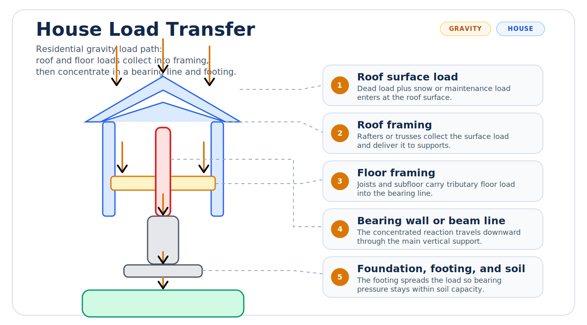
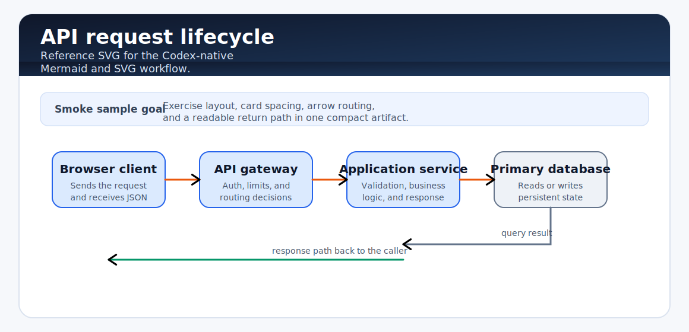

# codex-render-visuals

Production-ready SVG diagrams for Codex-compatible clients.

`codex-render-visuals` packages the `codex-visuals` skill: an image-first workflow for generating polished static visuals, validating them, and embedding them through standard Markdown images instead of unsupported custom renderers.

## Highlights

- Lean, production-oriented Codex skill under `codex-visuals/`
- SVG-first output with scripted PNG fallbacks for compatibility-sensitive clients
- Built-in validation, smoke rendering, install helpers, and example artifacts
- Designed around what Codex desktop reliably supports today

## Compatibility

| Client capability | Status | Default behavior |
| --- | --- | --- |
| Markdown image tag to local PNG | Supported | Compatibility fallback |
| Markdown image tag to local SVG | Expected in Codex-compatible clients | Primary authoring format |
| Mermaid fence | Client-dependent | Optional fallback for simple node-link diagrams |
| Raw HTML widgets / iframe visuals | Not a public guarantee | Out of scope for v1 |
| Custom `visualizer` fence | Unsupported in current Codex desktop builds | Not used by this repo |

## Install

Primary install uses Codex's GitHub skill installer and targets the `codex-visuals/` folder in this repository.

### PowerShell

```powershell
python "$env:USERPROFILE\.codex\skills\.system\skill-installer\scripts\install-skill-from-github.py" `
  --repo kappa9999/codex-render-visuals `
  --path codex-visuals
```

### macOS / Linux

```bash
python "$HOME/.codex/skills/.system/skill-installer/scripts/install-skill-from-github.py" \
  --repo kappa9999/codex-render-visuals \
  --path codex-visuals
```

### Manual fallback

1. Clone the repository.
2. Copy `codex-visuals/` into `~/.codex/skills/codex-visuals`.
3. Restart Codex.

Windows example:

```powershell
git clone https://github.com/kappa9999/codex-render-visuals.git
Copy-Item -Recurse .\codex-render-visuals\codex-visuals "$env:USERPROFILE\.codex\skills\codex-visuals"
```

POSIX example:

```bash
git clone https://github.com/kappa9999/codex-render-visuals.git
cp -R ./codex-render-visuals/codex-visuals "$HOME/.codex/skills/codex-visuals"
```

Bundled local install helpers are also included:

```powershell
powershell -ExecutionPolicy Bypass -File .\codex-visuals\scripts\install-skill-from-repo.ps1
```

```bash
bash ./codex-visuals/scripts/install-skill-from-repo.sh
```

Restart Codex after installation.

## First Run

Paste this into Codex:

```text
Use $codex-visuals to visualize load transfer in a house as a clean SVG diagram and embed it as an image.
```

Expected result:

- The skill chooses a diagram type and output mode
- It writes a standalone SVG artifact
- It validates the SVG
- It embeds the result as a Markdown image
- It falls back to PNG if SVG rendering looks inconsistent in the client

## Example Outputs

Prompt:

```text
Visualize load transfer in a house for a structural engineering explanation.
```

Rendered sample:



Second sample:

```text
Use $codex-visuals to draw a flowchart of an API request lifecycle from browser to database and back.
```

Rendered sample:



Included artifacts:

- [examples/house-load-transfer.svg](examples/house-load-transfer.svg)
- [examples/house-load-transfer.png](examples/house-load-transfer.png)
- [examples/api-request-lifecycle.svg](examples/api-request-lifecycle.svg)
- [examples/api-request-lifecycle.png](examples/api-request-lifecycle.png)
- [examples/prompts.md](examples/prompts.md)

## How It Works

1. `codex-visuals/SKILL.md` stays lean and procedural so the skill triggers correctly.
2. Detailed guidance lives in `codex-visuals/references/`.
3. Deterministic helpers in `codex-visuals/scripts/` handle output path creation, SVG validation, smoke rendering, PNG export, and install helpers.
4. The final user-visible output is a standard Markdown image, not a custom renderer.
5. PNG fallbacks are regenerated from SVG source files with a Chrome-based export script instead of manual screenshots.

## Repository Layout

```text
codex-render-visuals/
├── codex-visuals/        # Installable Codex skill
├── examples/             # Prompt gallery and sample outputs
├── tests/                # Validation and smoke tests
├── README.md
├── LICENSE
└── pyproject.toml
```

## Validation

For contributors and release testing:

```bash
python codex-visuals/scripts/quick_validate.py codex-visuals
python codex-visuals/scripts/render_smoke_svg.py --output-dir ./tmp/smoke
pytest
```

To refresh PNG fallbacks from the SVG source of truth:

```bash
python codex-visuals/scripts/export_svg_png.py examples/house-load-transfer.svg examples/api-request-lifecycle.svg
```

Release bar:

- Fresh install succeeds into a clean `~/.codex/skills` directory
- At least one real prompt renders correctly in Codex desktop
- Validation scripts pass
- Example screenshots and sample artifacts are current
- PNG fallbacks are regenerated from the current SVG sources

## Limitations

- This repository does not depend on a custom `visualizer` fence
- Interactive HTML widgets are intentionally out of scope for v1
- Mermaid support varies by client and should be treated as optional
- PNG export is a compatibility fallback, not the authoring source of truth

## Development

- Keep the skill folder optimized for Codex
- Keep repo-level setup and release docs in the repository root
- Prefer additive examples and tests over expanding `SKILL.md`
- Validate both metadata and output artifacts before publishing

## Repository

- GitHub: [kappa9999/codex-render-visuals](https://github.com/kappa9999/codex-render-visuals)

## License

MIT. See [LICENSE](LICENSE).
