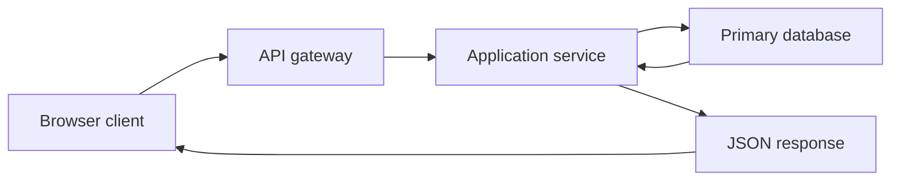
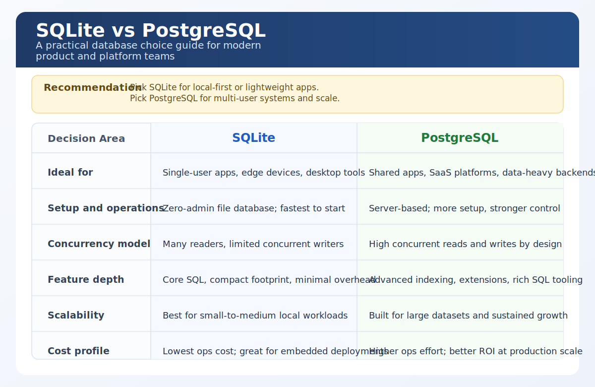

# codex-render-visuals

Native Mermaid and SVG visual skill for Codex-compatible clients.

`codex-render-visuals` packages `codex-visuals`, a production-oriented public skill that keeps Codex on native rendering paths. Use Mermaid for workflows and graphs. Use standalone SVG for engineering diagrams, annotated explainers, and comparison boards that need precise geometry.

## What It Supports

- Native Mermaid workflows and flowcharts
- Standalone SVG visuals that render cleanly as Markdown images
- Lean install and validation helpers for Codex skill packaging
- Curated examples that demonstrate the intended output standard

## What It Does Not Support

- PNG or raster export paths in the main workflow
- Browser-only rendering dependencies
- Custom `visualizer` fences or iframe widgets
- HTML-heavy interactive components as a default contract

## Install

Install the `codex-visuals/` folder with Codex's GitHub skill installer.

### PowerShell

```powershell
python "$env:USERPROFILE\.codex\skills\.system\skill-installer\scripts\install-skill-from-github.py" `
  --repo kappa9999/codex-render-visuals `
  --path codex-visuals
```

### macOS / Linux

```bash
python "$HOME/.codex/skills/.system/skill-installer/scripts/install-skill-from-github.py" \
  --repo kappa9999/codex-render-visuals \
  --path codex-visuals
```

### Local Repository Install

```powershell
powershell -ExecutionPolicy Bypass -File .\codex-visuals\scripts\install-skill-from-repo.ps1
```

```bash
bash ./codex-visuals/scripts/install-skill-from-repo.sh
```

Restart Codex after installation.

## How It Chooses Mermaid vs SVG

| Request pattern | Native mode | Why |
| --- | --- | --- |
| Workflow, lifecycle, graph, request path | Mermaid | Mermaid is lighter, faster, and reads well inline |
| Engineering section, load path, comparison board, annotated explainer | SVG | SVG gives precise layout control without leaving the native Codex path |
| Dense or client-unsupported interaction | Stay on Mermaid or SVG and state the limitation | v1 avoids non-native renderer assumptions |

## Curated Examples

### Engineering SVG: House Load Transfer

Use case: explain the gravity load path in a light-frame house without forcing the reader to zoom into overlapping callouts.

Prompt:

```text
Use $codex-visuals to visualize gravity load transfer in a typical house as a clean structural engineering SVG.
```

Preview:


Primary artifact: [`examples/house-load-transfer.svg`](./examples/house-load-transfer.svg)

### Workflow Mermaid: API Request Lifecycle

Use case: show a request moving through a browser, gateway, service, database, and response path using the native Mermaid route.

Prompt:

```text
Use $codex-visuals to draw an API request lifecycle from browser to database and back as a native Mermaid flowchart.
```

Preview:



Primary artifact: [`examples/api-request-lifecycle.mmd`](./examples/api-request-lifecycle.mmd)

Reference artifact: [`examples/api-request-lifecycle.svg`](./examples/api-request-lifecycle.svg)

### Comparison SVG: SQLite vs PostgreSQL

Use case: compare two technical choices in a board that reads cleanly at README scale and survives chat-size rendering.

Prompt:

```text
Use $codex-visuals to compare SQLite and PostgreSQL as a clean two-column SVG decision board for engineering teams.
```

Preview:



Primary artifact: [`examples/sqlite-vs-postgres.svg`](./examples/sqlite-vs-postgres.svg)

## Validation And Contribution Workflow

Run the product checks before publishing:

```bash
python codex-visuals/scripts/quick_validate.py codex-visuals
python codex-visuals/scripts/render_smoke_svg.py --output-dir ./tmp/smoke
python codex-visuals/scripts/validate_svg.py ./examples/house-load-transfer.svg
python codex-visuals/scripts/validate_svg.py ./examples/sqlite-vs-postgres.svg
pytest
```

Contributor expectations:

- Keep the public contract on Mermaid plus SVG only
- Add or update examples through `examples/catalog.json`
- Keep `README.md`, `examples/prompts.md`, and the example artifacts in sync
- Validate the exact SVGs that are surfaced in the repository

## Repository Layout

```text
codex-render-visuals/
├── codex-visuals/        # Installable public skill
├── examples/             # Curated examples and prompts
├── tests/                # Contract and validation tests
├── README.md
├── LICENSE
└── pyproject.toml
```

## License

MIT. See [LICENSE](./LICENSE).
