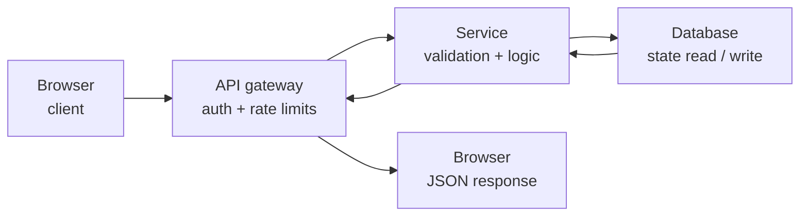

# codex-render-visuals

Production-ready Mermaid and SVG visuals for Codex-compatible clients.

`codex-render-visuals` packages the `codex-visuals` skill: a native-first workflow for generating Mermaid or SVG visuals that render cleanly in Codex-compatible clients without a browser-based export step.

## Highlights

- Lean, production-oriented Codex skill under `codex-visuals/`
- Native Codex path: Mermaid for flows, SVG for precise geometry
- No browser or rasterizer dependency required for normal Codex desktop use
- Built-in validation, smoke rendering, install helpers, and example artifacts
- Designed around what Codex desktop reliably supports today

## Compatibility

| Client capability | Status | Default behavior |
| --- | --- | --- |
| Mermaid fence | Supported in native Codex-style surfaces and GitHub | Primary flow/workflow mode |
| Markdown image tag to local SVG | Expected in Codex-compatible clients | Primary precision / engineering mode |
| Raw HTML widgets / iframe visuals | Not a public guarantee | Out of scope for v1 |
| Custom `visualizer` fence | Unsupported in current Codex desktop builds | Not used by this repo |

## Install

Primary install uses Codex's GitHub skill installer and targets the `codex-visuals/` folder in this repository.

### PowerShell

```powershell
python "$env:USERPROFILE\.codex\skills\.system\skill-installer\scripts\install-skill-from-github.py" `
  --repo kappa9999/codex-render-visuals `
  --path codex-visuals
```

### macOS / Linux

```bash
python "$HOME/.codex/skills/.system/skill-installer/scripts/install-skill-from-github.py" \
  --repo kappa9999/codex-render-visuals \
  --path codex-visuals
```

### Manual fallback

1. Clone the repository.
2. Copy `codex-visuals/` into `~/.codex/skills/codex-visuals`.
3. Restart Codex.

Windows example:

```powershell
git clone https://github.com/kappa9999/codex-render-visuals.git
Copy-Item -Recurse .\codex-render-visuals\codex-visuals "$env:USERPROFILE\.codex\skills\codex-visuals"
```

POSIX example:

```bash
git clone https://github.com/kappa9999/codex-render-visuals.git
cp -R ./codex-render-visuals/codex-visuals "$HOME/.codex/skills/codex-visuals"
```

Bundled local install helpers are also included:

```powershell
powershell -ExecutionPolicy Bypass -File .\codex-visuals\scripts\install-skill-from-repo.ps1
```

```bash
bash ./codex-visuals/scripts/install-skill-from-repo.sh
```

Restart Codex after installation.

## First Run

Paste this into Codex:

```text
Use $codex-visuals to visualize load transfer in a house as a clean SVG diagram and embed it as an image.
```

Expected result:

- The skill chooses the lightest native output mode that fits the request
- It writes a standalone SVG artifact when precise layout is needed
- It emits Mermaid directly for simple flows when that is the cleaner Codex-native option
- It validates SVGs before embedding them as images
- It stays on Mermaid or SVG for v1 instead of invoking a raster export step

## Example Outputs

Prompt:

```text
Visualize load transfer in a house for a structural engineering explanation.
```

Rendered sample:


Second sample:

```text
Use $codex-visuals to draw a flowchart of an API request lifecycle from browser to database and back.
```

Native Codex flow sample:



Reference SVG artifact:


Included artifacts:

- [examples/house-load-transfer.svg](examples/house-load-transfer.svg)
- [examples/api-request-lifecycle.mmd](examples/api-request-lifecycle.mmd)
- [examples/api-request-lifecycle.svg](examples/api-request-lifecycle.svg)
- [examples/prompts.md](examples/prompts.md)

## How It Works

1. `codex-visuals/SKILL.md` stays lean and procedural so the skill triggers correctly.
2. Detailed guidance lives in `codex-visuals/references/`.
3. Deterministic helpers in `codex-visuals/scripts/` handle output path creation, Mermaid fencing, SVG validation, smoke rendering, and install helpers.
4. Runtime output in Codex desktop stays native-first: Mermaid fence or SVG image.
5. v1 intentionally avoids a raster-export dependency in the core path.

## Repository Layout

```text
codex-render-visuals/
├── codex-visuals/        # Installable Codex skill
├── examples/             # Prompt gallery and sample outputs
├── tests/                # Validation and smoke tests
├── README.md
├── LICENSE
└── pyproject.toml
```

## Validation

For contributors and release testing:

```bash
python codex-visuals/scripts/quick_validate.py codex-visuals
python codex-visuals/scripts/render_smoke_svg.py --output-dir ./tmp/smoke
pytest
```

To print a Mermaid fence while also writing a deterministic `.mmd` artifact:

```bash
python codex-visuals/scripts/write_visual.py --slug api-request-lifecycle --format mmd --source-file ./examples/api-request-lifecycle.mmd --print-fence
```

Release bar:

- Fresh install succeeds into a clean `~/.codex/skills` directory
- At least one real prompt renders correctly in Codex desktop
- Validation scripts pass
- Example screenshots and sample artifacts are current
- Native Mermaid and SVG paths stay dependency-light

## Limitations

- This repository does not depend on a custom `visualizer` fence
- Interactive HTML widgets are intentionally out of scope for v1
- Mermaid should still be kept to graph-style diagrams, not dense engineering sections
- Raster export is intentionally out of scope for v1

## Development

- Keep the skill folder optimized for Codex
- Keep repo-level setup and release docs in the repository root
- Prefer additive examples and tests over expanding `SKILL.md`
- Validate both metadata and output artifacts before publishing

## Repository

- GitHub: [kappa9999/codex-render-visuals](https://github.com/kappa9999/codex-render-visuals)

## License

MIT. See [LICENSE](LICENSE).
