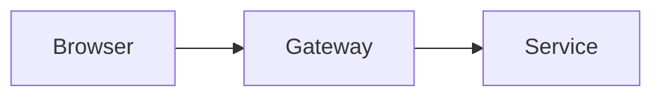

# Codex Visuals

Use this skill to turn explanations into polished static visuals that render reliably in Codex-compatible clients.

## When To Use It

Trigger this skill when the user asks to:

- visualize or diagram a concept
- show a load path, system architecture, workflow, or comparison
- explain how something works spatially or sequentially
- turn data into a small chart or annotated visual
- replace a text-heavy explanation with a clearer image

Prefer this skill proactively when a diagram would clarify relationships better than prose.

## Production Defaults

1. For Codex desktop, prefer Mermaid for simple flows, lifecycles, and graph-style diagrams.
2. Use standalone SVG plus a Markdown image tag for engineering, illustrative, or tightly annotated visuals.
3. Treat PNG export as optional publishing fallback, not the default Codex runtime path.
4. Never assume a custom renderer, HTML widget, iframe sandbox, or JavaScript bridge exists.

Before the first visual in a conversation, read:

- `references/client-compatibility.md`
- `references/design-system.md`
- `references/diagram-patterns.md`

Read these only when needed:

- `references/chart-patterns.md` for charts
- `references/quality-checklist.md` before finalizing a complex or user-facing visual

## Workflow

### 1. Choose The Visual Type

Route on the user's intent:

- "How does this work?" -> illustrative or mechanism diagram
- "What are the parts?" -> structural diagram
- "What are the steps?" -> flow diagram
- "Compare these options" -> comparison layout
- "Show the data" -> simple SVG chart

### 2. Choose The Output Mode

Use the capability ladder from `references/client-compatibility.md`.

- Native flow path: Mermaid fence for simple graphs and workflows in Codex desktop
- Native precise path: SVG file plus Markdown image
- Optional publishing fallback: PNG file plus Markdown image

For Codex desktop, native output should stay dependency-light: Mermaid when the diagram can be expressed as a graph, SVG image when it cannot.

### 3. Write The Artifact

Use `scripts/write_visual.py` when you want deterministic output paths.

Recommended pattern:

```bash
python codex-visuals/scripts/write_visual.py --slug house-load-transfer --format svg --output-dir ./visuals --source-file ./draft.svg --print-markdown --alt "House load transfer diagram"
```

For Mermaid output:

```bash
python codex-visuals/scripts/write_visual.py --slug api-request-lifecycle --format mmd --output-dir ./visuals --source-file ./draft.mmd --print-fence
```

If you already have the final SVG content, you may also write it directly. Keep filenames short, lowercase, and hyphenated.

### 4. Validate Before Sending

For SVG output, run:

```bash
python codex-visuals/scripts/validate_svg.py /absolute/path/to/file.svg
```

Run `references/quality-checklist.md` mentally before responding. For repo maintenance, use:

```bash
python codex-visuals/scripts/quick_validate.py
python codex-visuals/scripts/render_smoke_svg.py --output ./tmp/smoke.svg
```

### 5. Respond Cleanly

Use a short intro, then the image, then one concise caption or note if needed.

Preferred response shape:

1. One sentence of context
2. Markdown image tag
3. One sentence of interpretation or limitation

Do not dump raw SVG, HTML, or oversized setup text into the answer unless the user explicitly asks for source.

## Output Contract

For SVG and PNG output:

- use absolute file paths in Markdown image tags
- include accessible alt text
- keep visuals self-contained with no external fonts, scripts, or network references
- add `<title>` and `<desc>` to SVGs
- use transparent or white backgrounds
- keep labels readable at normal chat width
- save the source SVG even if you also export PNG

Example embedding:

```markdown

```

For Mermaid output:



## Quality Bar

Every shipped visual should be:

- correct in structure and labeling
- readable without zooming
- compact enough for chat
- visually calm rather than decorative
- safe to render without client-specific features

If a request needs true interactivity, say so explicitly and fall back to the best static representation unless the client capability is known.
