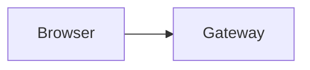

# Client Compatibility

Choose the lightest native format that the client can render reliably.

## Native Capability Ladder

1. Mermaid fence for graph-style workflows and lifecycles
2. Standalone SVG embedded with a Markdown image tag
3. Raw source only when the user explicitly asks for source

Do not assume anything above this ladder exists.

## Codex Desktop Default

- Use Mermaid first for simple flows, request paths, and graph-like diagrams.
- Use SVG images for engineering visuals, comparison boards, and annotated layouts.
- Use absolute paths when embedding local SVG files in chat responses.

## Unsupported For v1

- PNG or raster-only outputs as the primary path
- Custom `visualizer` fences
- HTML widgets, `foreignObject`, or script-driven interactivity
- Browser-export requirements

## Embedding Rules

SVG image:

```markdown

```

Mermaid:


